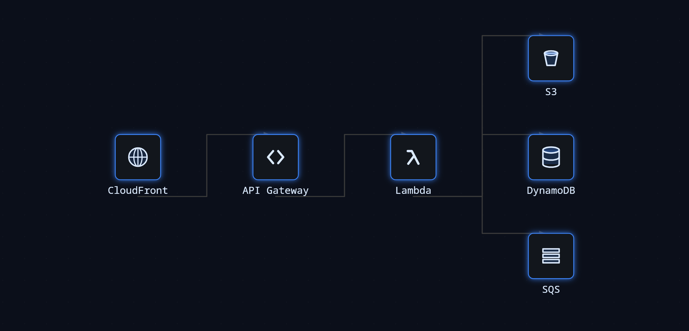
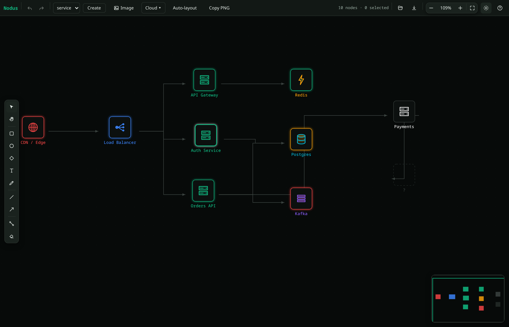

<div align="center">

<picture>
  <source media="(prefers-color-scheme: dark)" srcset="./assets/nodus-logo-dark.svg" />
  
</picture>

<br />

**Git-native diagrams you can code-review.**

A **headless, framework-agnostic, extensible diagram engine** for TypeScript — think Excalidraw, but
built to be customized and to store its diagrams as text that diffs cleanly and reviews in a PR. Nodus
owns *model → layout → render → interact* on a Canvas-2D surface and gets out of your way for
everything else. The infra-architecture tool that seeded it (**InfraCanvas**) now ships as one
[preset](./packages/preset-infra) on top of the general core.

<br />

[](https://github.com/ahmazin/nodus/actions/workflows/ci.yml)
[](./LICENSE)
[](./tsconfig.json)
[](./docs/stability.md)


</div>

<div align="center">
  
</div>

<p align="center">
  <sub><em>A cloud architecture rendered headlessly by <a href="./scripts/demos.ts"><code>scripts/demos.ts</code></a>
  (<code>pnpm demos</code>) — real cloud glyphs, neon node tiles, and orthogonal connectors on a dark canvas.
  Identical code paints to the browser and to Skia in Node.</em></sub>
</p>

---

## Why

- **Git-native** — deterministic, canonical serialization means diagrams are `*.nodus.json` with
  clean, reviewable diffs. The `nodus` CLI (`fmt` / `render` / `diff`) and a CI workflow turn diagrams
  into "diagrams you can code-review."
- **Canvas-2D at scale** — a retained render index (R-tree) drives viewport culling, marquee, and
  two-phase hit-testing from one structure. Draws in the browser *or* headless (Skia) with identical code.
- **Reactive core** — a tiny signals engine (`atom`/`computed`/`effect`/`transact`) means the renderer
  only repaints what changed; a mutation half-applied inside `transact` rolls all the way back.
- **Editable** — pan/zoom, select/multi-select, drag, create, connect, inline-rename, delete, and
  delta-based undo/redo where one gesture collapses to one undo entry.
- **Extensible on four axes** — custom node/edge **types**, design-token **theming**, pluggable
  auto-**layout**, and **plugins/events/overlays**.
- **Headless-first** — the core has zero framework or DOM dependencies; a thin `@nodus/react` binding
  adds the canvas host and inline text overlay.

## Packages

pnpm workspace monorepo. Each package points `main`/`types` at `./src/index.ts`, and Vite/Vitest alias
every `@nodus/*` to `packages/*/src` — the example app, tests, and CLI run the TypeScript **source**
directly, so editing a package is picked up live with no build.

| Package | What |
|---|---|
| `@nodus/core` | The whole engine: signals, store, scene index, camera, geometry, theming (+ theme pack), pluggable routers, icons, renderer, tools, snapping, history, diff, serialization, editor. Deps: `rbush` + vendored signals. |
| `@nodus/react` | React binding — `<Nodus>` host, panels (`Properties`, `CommandPalette` ⌘K, context menu, `Minimap`, flow controls, cloud-icon picker), the `ui/*` design system (tokens + primitives, light/dark), `useValue`, clipboard/PNG export. |
| `@nodus/preset-infra` | Infra preset: six semantic node types + icons, dark/light themes, connector edge, Freeform/Reveal/Stages arena adapters, and the `InfraCanvas({model, mode, overlays})` façade. |
| `@nodus/preset-diagrams` · `@nodus/preset-draw` | General diagram types (flowchart, state-machine, ERD, org-chart, icon nodes) / freehand drawing tools. |
| `@nodus/plugin-freehand` | A pen tool + stroke node type — a whole new interaction, registered through the public plugin API. |
| `@nodus/layout-dagre` · `-tree` · `-force` · `-elk` | Auto-layout adapters (layered · tidy-tree · force-directed · ELK, worker-capable). |
| `@nodus/icons-cloud` | Curated AWS / Azure / GCP glyphs, registered as namespaced `provider:service` icons. |
| `@nodus/from-mermaid` · `@nodus/text-to-diagram` · `@nodus/import-infra` | Importers — Mermaid, an LLM tool schema (describe a system → a diagram), and `fromTerraform` / `fromKubernetes`. |
| `@nodus/cli` | The `nodus` CLI — `fmt` / `render` / `diff` over `*.nodus.json`. |
| `@nodus/mcp` · `@nodus/persistence` | MCP server exposing the engine as tools · snapshot storage. |

## Quick start

### Headless (Node / any bundler)

```ts
import { Editor } from '@nodus/core';
import { installInfraPreset } from '@nodus/preset-infra';

const editor = new Editor({ viewport: { w: 1200, h: 700 } });
installInfraPreset(editor);

const a = editor.createNode({ type: 'infra.service', label: 'API', x: 0, y: 0 });
const b = editor.createNode({ type: 'infra.db', label: 'Postgres', x: 300, y: 0 });
editor.connect({ kind: 'node', nodeId: a, portId: 'out' }, { kind: 'node', nodeId: b, portId: 'in' });

const json = editor.toJSON(); // canonical, diff-friendly snapshot
```

A bare `new Editor()` already has the built-in `rect` / `line` / `group` types, so you can skip the
preset for generic diagrams.

### React

```tsx
import { useMemo } from 'react';
import { Nodus } from '@nodus/react';
import { InfraCanvas } from '@nodus/preset-infra';

function App() {
  const { editor } = useMemo(
    () => InfraCanvas({ model: { nodes: [/* … */], edges: [/* … */] } }),
    [],
  );
  return <Nodus editor={editor} style={{ width: '100%', height: '100%' }} />;
}
```

`<Nodus>` wires pointer/wheel/keyboard to the editor's tools, runs a signal-reactive rAF render loop,
and hosts the inline label editor. The full interactive demo is in
[`examples/browser`](./examples/browser) (`pnpm dev` → http://localhost:5188). See
[`@nodus/react`](./packages/react#readme) for panels, hooks, the design system, and PNG export.

> **React SSR / RSC:** `@nodus/react` ships a `'use client'` banner and a server snapshot for its
> hooks, so importing it never crashes a server render. The canvas paints after hydration; when you
> need it fully client-only (e.g. Next.js Pages Router) use `dynamic(() => …, { ssr: false })`. See
> the [React binding guide](./apps/site/src/pages/docs/react.md#server-side-rendering).

<div align="center">
  
</div>

<p align="center">
  <sub><em>The same engine, interactive: the <a href="./examples/browser"><code>examples/browser</code></a>
  playground — toolbar, tool-rail, live minimap, cloud-icon insert, and multi-select — driven entirely
  through the public <code>Editor</code> API. Run <code>pnpm dev</code> → http://localhost:5188.</em></sub>
</p>

## Git-native diagrams

`@nodus/core` serializes deterministically — stable key order, normalized numbers — so a diagram is a
text artifact with clean diffs. The `nodus` CLI (run via `pnpm nodus`) makes that a review workflow,
and [`.github/workflows/diagrams.yml`](./.github/workflows/diagrams.yml) enforces canonical form on
any PR touching a `*.nodus.json` and posts rendered previews.

```bash
pnpm nodus fmt --check diagrams/*.nodus.json          # verify canonical form (the CI gate)
pnpm nodus fmt diagrams/architecture.nodus.json       # canonicalize in place
pnpm nodus render diagrams/architecture.nodus.json --out arch.png   # headless PNG
pnpm nodus diff old.nodus.json new.nodus.json         # semantic diff
```

## Extending

A **custom node type** is one object implementing `NodeUtil` — geometry (the single source for
hit-test/bounds/cull), ports, and a `draw`:

```ts
import { Rectangle2d, type NodeUtil } from '@nodus/core';

const cylinderNode: NodeUtil = {
  type: 'cylinder',
  getDefaultProps: () => ({}),
  getDefaultSize: () => ({ w: 120, h: 60 }),
  getGeometry: (n) => new Rectangle2d({ x: n.x, y: n.y, w: n.w, h: n.h }),
  getPorts: () => [
    { id: 'in', kind: 'target', anchor: { x: 0, y: 0.5 } },
    { id: 'out', kind: 'source', anchor: { x: 1, y: 0.5 } },
  ],
  draw: (api, n, tokens) => {
    api.fillRoundRect({ x: n.x, y: n.y, w: n.w, h: n.h }, 8, tokens.fill, { glow: tokens.glow });
    api.strokeRoundRect({ x: n.x, y: n.y, w: n.w, h: n.h }, 8, tokens.stroke, { width: tokens.strokeWidth });
    api.label(n.label ?? '', { x: n.x + n.w / 2, y: n.y + n.h / 2 });
  },
};

editor.registerNodeType(cylinderNode); // now usable anywhere
```

The other axes: `editor.setTheme(theme)` (token-based, resolved at draw time), `editor.registerLayout(engine)`
+ `await editor.layout('dagre', { direction: 'LR' })`, and `editor.use(plugin)` where a plugin gets an
`EngineHost` to register types/tools/themes/layouts/overlays and hook the store & event bus.

## Design tokens

Themes are data. `resolveTokens(theme, { state, overlay, focused }, type)` layers slices at draw time:

```
base  <  byType[type]  <  states[state]  <  overlays[overlay]  <  focus
```

So a node's look is a function of its **type** (accent color) and its **visual state**. `Theme.appearance`
(`'light' | 'dark'`) is the single source of truth for light/dark, so DOM chrome and the canvas re-skin
together — swap the theme atom and every node re-skins in one frame.

## Development

```bash
pnpm install       # corepack pnpm; builds are pinned (esbuild)
pnpm dev           # Vite example app → http://localhost:5188
pnpm typecheck     # tsc --strict across all packages — the static correctness gate (no eslint/prettier)
pnpm test          # vitest run (whole suite, node environment)
pnpm verify:render # headless Skia render → examples/output/*.png + interaction/serialization smoke checks
pnpm verify:all    # typecheck + test + verify:render
pnpm build         # tsup per package, in dependency order (ESM + CJS + .d.ts)
```

There is **no lint step** — `tsc` with `strict` + `noUncheckedIndexedAccess` is the correctness gate.
The dev loop is source-first: no `pnpm build` is needed while developing.

CI ([`.github/workflows/ci.yml`](./.github/workflows/ci.yml)) gates every PR and every push to
`main`/`mainline` with four jobs: `typecheck` + the full `test` suite + a headless-Skia `verify:render`;
a **dist-consumption** job that packs real npm tarballs and imports them from *outside* the workspace
(the one path the source-first dev loop never exercises); a **changeset** check so consumer-visible
changes ship with release notes; and a headless-Chromium interaction E2E
([`scripts/browser-verify.mjs`](./scripts/browser-verify.mjs)) that drives the live Vite app and asserts
create/drag/undo/rename/auto-layout with zero console errors. The badge above tracks the `CI` workflow.

## Architecture

Reactive record store (the single mutation channel) → a retained `RenderItem` scene index (rbush) →
a layered Canvas-2D renderer, with all type-specific behavior in engine-owned registries.

- **One mutation channel** — `store.apply(changes, { capture })` computes inverse deltas, updates
  per-record signal atoms atomically, and notifies the index/history/events through one path.
- **Edges own their endpoints**; back-refs and routes are derived, so moving a node reflows its edges
  and deleting it cascades them.
- **Three version concepts** kept distinct: `record.version` (diff/cache), scene-index version
  (render invalidation), `schemaVersion` (migration).

See [`@nodus/core`](./packages/core#readme) for the full architecture and extension model.

## Stability

Every `@nodus/*` package is **pre-1.0 (0.x)** — a minor bump (`0.Y.0`) may break; a patch (`0.0.Z`) is
additive or fixes only. Canonical `*.nodus.json` bytes are a versioned contract (a byte change is
breaking). See [`docs/stability.md`](./docs/stability.md) for the full policy — the public-API
boundary, deprecations, and the canonical-byte contract — and [`RELEASING.md`](./RELEASING.md) for the
changesets release flow.

## License

MIT — see [LICENSE](./LICENSE).
