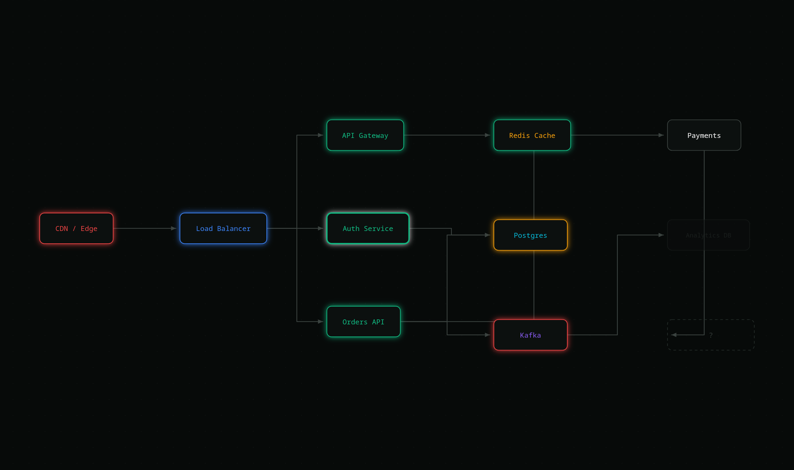

# Nodus

A **headless, framework-agnostic, extensible diagram engine** for TypeScript — think Excalidraw,
but built to be customized. Nodus owns *model → layout → render → interact* on a Canvas-2D surface
and gets out of your way for everything else. The infra-architecture tool that seeded this project
(**InfraCanvas**) now ships as one preset on top of the general core.

> Working name: **Nodus** (`@nodus/*`). See [`packages/`](./packages) for the monorepo.



*(Rendered headlessly by [`scripts/render-demo.ts`](./scripts/render-demo.ts) — dark canvas, per-type
accent glows, the neutral `solid` node, the faded `ghost` node, the dashed `locked` "?" node,
met/partial/missed evaluation rings, and orthogonal arrowed connectors.)*

---

## Why

- **Canvas-2D at scale** — a retained render index (R-tree) drives viewport culling, marquee, and
  two-phase hit-testing from one structure. Draws in the browser *or* headless (Skia) with identical code.
- **Reactive core** — a tiny signals engine (`atom`/`computed`/`effect`/`transact`) means the renderer
  only repaints what changed; a mutation half-applied inside `transact` rolls all the way back.
- **Editable** — pan/zoom, select/multi-select, drag, create, connect, inline-rename, delete, and
  delta-based undo/redo where one gesture collapses to one undo entry.
- **Extensible on four axes** — custom node/edge **types**, design-token **theming**, pluggable
  auto-**layout**, and **plugins/events/overlays**.
- **Headless-first** — the core has zero framework or DOM dependencies; a thin `@nodus/react` binding
  adds the canvas host and inline text overlay.

## Packages

| Package | What |
|---|---|
| `@nodus/core` | The whole engine: signals, store, scene index, camera, geometry, theming (+ theme pack), pluggable routers, icons, renderer, tools, snapping, history, diff, serialization, editor. Deps: `rbush` + vendored signals. |
| `@nodus/react` | React binding — `<Nodus>` host, `<Minimap>`, `<CommandPalette>` (⌘K), context menu, `useValue`. |
| `@nodus/preset-infra` | Infra preset: six semantic node types + icons, dark theme, connector edge, Freeform/Reveal/Stages arena adapters, and the `InfraCanvas({model, mode, overlays})` facade. |
| `@nodus/preset-diagrams` | General diagram types (flowchart, state-machine, ERD, org-chart, icon nodes) + builder helpers. |
| `@nodus/plugin-freehand` | A pen tool + stroke node type — a whole new interaction, registered through the public plugin API. |
| `@nodus/layout-dagre` · `-tree` · `-force` · `-elk` | Auto-layout adapters (layered · tidy-tree · force-directed · ELK, worker-capable). |
| `@nodus/text-to-diagram` | An Anthropic tool schema + converter: an LLM describes a system → a diagram. No LLM/network deps. |
| `@nodus/import-infra` | `fromTerraform(showJson)` and `fromKubernetes(objects)` → infra diagrams from live infrastructure. |

## Quick start

### Headless (Node / any bundler)

```ts
import { Editor } from '@nodus/core';
import { installInfraPreset } from '@nodus/preset-infra';

const editor = new Editor({ viewport: { w: 1200, h: 700 } });
installInfraPreset(editor);

const a = editor.createNode({ type: 'infra.service', label: 'API', x: 0, y: 0 });
const b = editor.createNode({ type: 'infra.db', label: 'Postgres', x: 300, y: 0 });
editor.connect({ kind: 'node', nodeId: a, portId: 'out' }, { kind: 'node', nodeId: b, portId: 'in' });

const json = editor.toJSON();              // versioned snapshot
// const png = await editor.toPNG(createCanvas); // raster export (inject a canvas factory)
```

### React

```tsx
import { useMemo } from 'react';
import { Editor } from '@nodus/core';
import { Nodus } from '@nodus/react';
import { InfraCanvas } from '@nodus/preset-infra';

function App() {
  const { editor } = useMemo(
    () => InfraCanvas({ model: { nodes: [/* … */], edges: [/* … */] } }),
    [],
  );
  return <Nodus editor={editor} style={{ width: '100%', height: '100%' }} />;
}
```

`<Nodus>` wires pointer/wheel/keyboard to the editor's tools, runs a signal-reactive rAF render loop,
and hosts the inline label editor. Space+drag pans, ctrl+wheel zooms, double-click renames.

The full interactive demo is in [`examples/browser`](./examples/browser) (`vite`).

## Extending

A **custom node type** is one object implementing `NodeUtil` — geometry (the single source for
hit-test/bounds/cull), ports, and a `draw`:

```ts
import { Rectangle2d, type NodeUtil } from '@nodus/core';

const cylinderNode: NodeUtil = {
  type: 'cylinder',
  getDefaultProps: () => ({}),
  getDefaultSize: () => ({ w: 120, h: 60 }),
  getGeometry: (n) => new Rectangle2d({ x: n.x, y: n.y, w: n.w, h: n.h }),
  getPorts: () => [
    { id: 'in', kind: 'target', anchor: { x: 0, y: 0.5 } },
    { id: 'out', kind: 'source', anchor: { x: 1, y: 0.5 } },
  ],
  draw: (api, n, tokens) => {
    api.fillRoundRect({ x: n.x, y: n.y, w: n.w, h: n.h }, 8, tokens.fill, { glow: tokens.glow });
    api.strokeRoundRect({ x: n.x, y: n.y, w: n.w, h: n.h }, 8, tokens.stroke, { width: tokens.strokeWidth });
    api.label(n.label ?? '', { x: n.x + n.w / 2, y: n.y + n.h / 2 });
  },
};

editor.registerNodeType(cylinderNode); // now usable anywhere
```

The other axes: `editor.setTheme(theme)` (token-based, resolved at draw time), `editor.registerLayout(engine)`
+ `await editor.layout('dagre', { direction: 'LR' })`, and `editor.use(plugin)` where a plugin gets an
`EngineHost` to register types/tools/themes/layouts/overlays and hook the store & event bus.

## Design tokens

Themes are data. `resolveTokens(theme, { state, overlay, focused }, type)` layers slices at draw time:

```
base  <  byType[type]  <  states[state]  <  overlays[overlay]  <  focus
```

So a node's look is a function of its **type** (accent color) and its **visual state** — `accent`,
`solid`, `ghost`, `locked`, plus overlay rings (`met`/`partial`/`missed`) and a `focused` emphasis.
Swap the theme atom and every node re-skins in one frame.

## Verify

```bash
pnpm install
pnpm typecheck              # tsc across all packages
pnpm test                   # vitest (31 invariant tests)
pnpm verify:render          # headless render → examples/output/*.png + smoke checks
node scripts/browser-verify.mjs   # drives the live Vite app in headless Chromium (needs `vite` running)
```

`scripts/render-demo.ts` writes four PNGs (`demo-infra`, `-selected`, `-dagre`, `-export`) and runs
interaction/serialization smoke checks. `scripts/browser-verify.mjs` launches Chromium against the
running example and asserts create/drag/undo/rename/auto-layout all work with zero console errors.

## Architecture

Reactive record store (the single mutation channel) → a retained `RenderItem` scene index (rbush) →
a layered Canvas-2D renderer, with all type-specific behavior in engine-owned registries. Full design
notes and the staged roadmap live in the plan under `~/.claude/plans/`. Highlights:

- **One mutation channel** — `store.apply(changes, { capture })` computes inverse deltas, updates
  per-record signal atoms atomically, and notifies the index/history/events through one path.
- **Edges own their endpoints**; back-refs and routes are derived, so moving a node reflows its edges
  and deleting it cascades them.
- **Three version concepts** kept distinct: `record.version` (diff/cache), scene-index version
  (render invalidation), `schemaVersion` (migration).

## Status

The full build roadmap (`docs/ROADMAP.md`) is **complete** — 11 packages, 61 tests, all building to
ESM+CJS+`.d.ts`:

- **Editing:** pan/zoom, select/marquee, drag with **snapping + alignment guides**, create, connect,
  inline rename, **grouping/frames**, **copy/paste/duplicate**, delta undo/redo, **command palette**,
  **context menu**, **minimap**.
- **Extensibility:** custom node/edge **types** + **icon** glyphs, **theme pack**, pluggable
  **routers** (straight/orthogonal/bezier) and **layouts** (dagre/tree/force/elk), **plugins/events**.
- **Presets & demos:** infra, general diagrams (flowchart/state-machine/ERD/org), **freehand sketch**,
  cloud architecture.
- **Integrations:** **text→diagram** (LLM tool schema), **live infra import** (Terraform / Kubernetes),
  and the three **arenas** (Studio/Reverse/Evolution).

Rendered examples live in `examples/output/` (`pnpm gallery`, `pnpm demos`, `pnpm leverage`).
Still deferred by design: the a11y mirror-DOM depth, dirty-rect compositing, and the WebGL backend
(the renderer seam is in place for it).

## License

MIT (intended).
